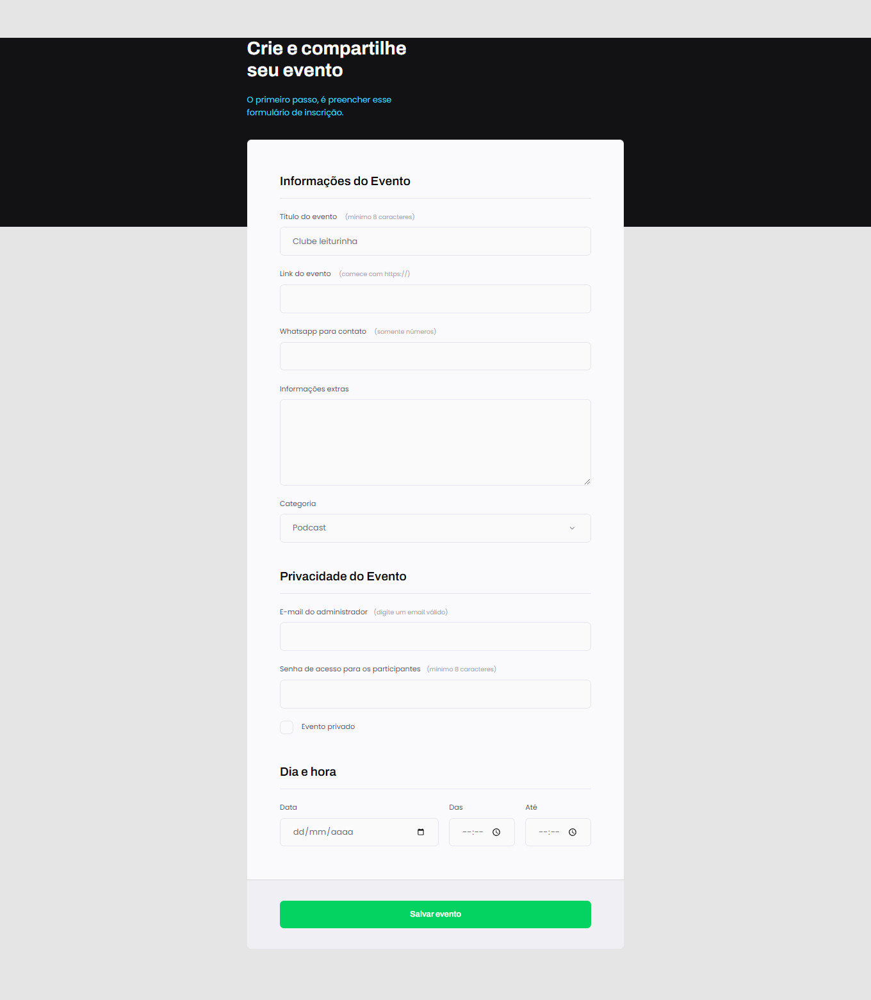
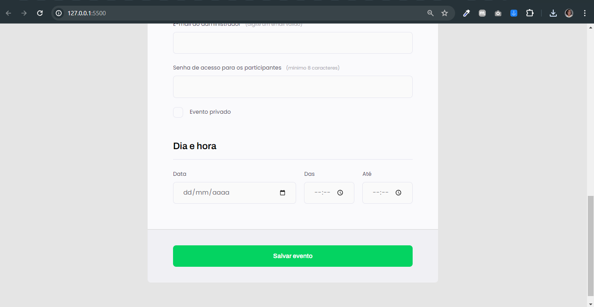

<h1 align="center">Projeto 01 : Crie seu evento
</h1>

Explorer Stag 3

  <a href="#tecnologias" style="color: #ffb4a2">Tecnologias</a>&nbsp;&nbsp;&nbsp;|&nbsp;&nbsp;&nbsp;
  <a href="#aprendizado" style="color: #ffb4a2">Principais aprendizados</a>&nbsp;&nbsp;&nbsp;|&nbsp;&nbsp;&nbsp;
  <a href="#projeto" style="color: #ffb4a2">Projeto</a>&nbsp;&nbsp;&nbsp;|&nbsp;&nbsp;&nbsp;
  <a href="#como-executar" style="color: #ffb4a2">Como executar</a>&nbsp;&nbsp;&nbsp;|&nbsp;&nbsp;&nbsp;
  <a href="#licença" style="color: #ffb4a2">Licença</a>

 

  

  

<h2 id="tecnologias" style="color: #fca311">🚀 Tecnologias</h2>

Esse projeto foi desenvolvido com as seguintes tecnologias:

- HTML e CSS

<h2 id="aprendizado" style="color: #fca311">📃 Principais aprendizados:</h2>

- Uso de tags semânticas no HTML
- Estilização de formulário
- Uso de fontes customizadas com Google Fonts
- Validação de dados dos campos do formulário
- Implementação de legendas e labels para acessibilidade
- Uso de seletores avançados de CSS
- Configuração de propriedades de layout (display, flexbox)
- Uso de unidades de medida relativas e absolutas no CSS

<h2 id="projeto" style="color: #fca311">💻 Projeto</h2>

O "Crie seu Evento" é uma plataforma web que facilita a criação, personalização e compartilhamento de eventos online. Através de um formulário simples e intuitivo, os usuários podem definir os detalhes de seus eventos, como título, link, contato, categoria, privacidade, data e horário. A interface amigável e moderna proporciona uma experiência de usuário agradável e eficiente.

<h2 id="como-executar" style="color: #fca311">🔖 Como executar</h2>

Clone o repositório para o seu ambiente local.

Abra o arquivo index.html no seu navegador preferido.

<h2 id="licença" style="color: #fca311">  📝Licença</h2>

Esse projeto está sob a licença MIT.